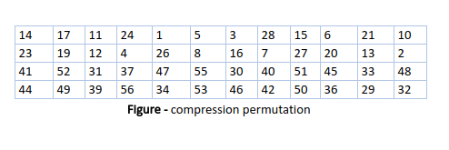

---

# Cryptography - A hands-on session

## ~Arpit
---
## What is cryptography?

Cryptography is the science of using mathematics to encrypt and decrypt data. Cryptography enables you to store sensitive information or transmit it across insecure networks (like the Internet) so that it cannot be read by anyone except the intended recipient. 

## What is Cryptanalysis ? 
Cryptanalysis is the science of analyzing and breaking secure communication. Classical cryptanalysis involves an interesting combination of analytical reasoning, application of mathematical tools, pattern finding, patience, determination, and luck. Cryptanalysts are also called attackers.

## Cryptology

Cryptology embraces both cryptography and cryptanalysis. 


## How does cryptography work?
A cryptographic algorithm, or cipher, is a mathematical function used in the encryption and decryption process. A cryptographic algorithm works in combination with a key — a word, number, or phrase — to encrypt the plaintext. The same plaintext encrypts to different ciphertext with different keys. The security of encrypted data is entirely dependent on two things: the strength of the cryptographic algorithm and the secrecy of the key. 

---
## Topic to be covered :

<pre>	
	Types of cryptography
	Symmetric Key Cryptography
		DES (Data Encryption Standard)
		AES (Advanced Encryption Algorithm)
		Modes of Encryption

	Asymmetric key cryptography 
		RSA (Rivest–Shamir–Adleman)
			(hands-on)
		DHE (Diffie Hellman Key Exchange)
		PGP (Pretty Good Privacy)
		openssl 
			(hands-on)
	Hashing
		MD5 collision attack 
			(hands-on)
	</pre>

---

## Types of cryptography

----

* Symmetric Key Cryptography


* Asymmetric key cryptography (Public key crypto)


---
## Symmetric Key Cryptography

## 1) __DES__

* DES is a block cipher, and encrypts data in blocks of size of 64 bit each, means 64 bits of plain text goes as the input to DES, which produces 64 bits of cipher text. 
* The same algorithm and key are used for encryption and decryption, with minor differences. 
* The key length is initally is 64 bits. But with each byte, there is a parity byte which makes the effective key size of 56 bits. That is bit position 8, 16, 24, 32, 40, 48, 56 and 64 are discarded. 
* DES is based on the two fundamental attributes of cryptography: substitution (also called as confusion) and transposition (also called as diffusion). 
* DES consists of 16 steps, each of which is called as a round.

### Substition Cipher


### Transposition Cipher


----

### Broad-level steps in DES.

<ol>
<li> In the first step, the 64 bit plain text block is handed over to an initial Permutation (IP) function. </li>
<li> The initial permutation performed on plain text. </li>
<li> Next the initial permutation (IP) produces two halves of the permuted block; says Left Plain Text (LPT) and Right Plain Text (RPT). </li>
<li> Now each LPT and RPT to go through 16 rounds of encryption process. </li>
<li> In the end, LPT and RPT are rejoined and a Final Permutation (FP) is performed on the combined block </li>
<li> The result of this process produces 64 bit cipher text. </li>
</ol>


<b>Initial Permutation (IP)</b> –  It happens before the first round. It suggests how the transposition in IP should proceed, as show in figure. 


#### Key transformation

From this 56-bit key, a different 48-bit Sub Key is generated during each round using a process called as key transformation. For this the 56 bit key is divided into two halves, each of 28 bits. These halves are circularly shifted left by one or two positions, depending on the round. After an appropriate shift, 48 of the 56 bit are selected.  Since the key transformation process involves permutation as well as selection of a 48-bit sub set of the original 56-bit key it is called Compression Permutation.




----
### One DES Round


<b>Expansion Permutation Box</b> − Since right input is 32-bit and round key is a 48-bit, we first need to expand right input to 48 bits. Permutation logic is graphically depicted in the following illustration −


<b> XOR (Whitener) </b>− After the expansion permutation, DES does XOR operation on the expanded right section and the round key. The round key is used only in this operation.

<b> Substitution Boxes </b>− The S-boxes carry out the real mixing (confusion). DES uses 8 S-boxes, each with a 6-bit input and a 4-bit output. There are a total of eight S-box tables. The output of all eight s-boxes is then combined in to 32 bit section. Refer the following illustration −


<b> Straight Permutation </b>− The 32 bit output of S-boxes is then subjected to the straight permutation with rule shown in the following illustration:


Refer to https://www.tutorialspoint.com/cryptography/data_encryption_standard.htm

----

## 2) __AES__

AES is an iterative rather than Feistel cipher. It is based on 'substitution–permutation network'. It comprises of a series of linked operations, some of which involve replacing inputs by specific outputs (substitutions) and others involve shuffling bits around (permutations).

Interestingly, AES performs all its computations on bytes rather than bits. Hence, AES treats the 128 bits of a plaintext block as 16 bytes. These 16 bytes are arranged in four columns and four rows for processing as a matrix.

Unlike DES, the number of rounds in AES is variable and depends on the length of the key. AES uses 10 rounds for 128-bit keys, 12 rounds for 192-bit keys and 14 rounds for 256-bit keys. Each of these rounds uses a different 128-bit round key, which is calculated from the original AES key.


## 3) Modes of Encryption
### ECB (Electronic Code Block)


### ECB Decryption


### CBC (Cipher Block Chaining)


### CBC Decryption


### CFB (Cipher Feedback)


### CFB Decryption


### OFB (Ouput Feedback)


### OFB Decryption


### CTR (Counter Mode)


### CTR Decryption


----

### Question
During the transmission of the ciphertext, the fifth bit of the second block is corrupted. Without knowing that, the receiver decrypts the message. Assume there are 10 blocks. How many blocks do you think can be decrypted successfully in each mode of encryption ?

----
### Answer 
<pre><font size="8">
ECB - only 1 block will be corrupted.
CBC - 2 blocks, block 2 and block 3 are corrupted.
CFB - 2 blocks will be corrupted.
OFB - only 5th bit of block 2 will be corrupted.
CTR - only 5th bit of block 2 will be corrupted.
</font>
</pre>


Good read on Modes of Encryption
https://stackoverflow.com/questions/1220751/how-to-choose-an-aes-encryption-mode-cbc-ecb-ctr-ocb-cfb

---

## Asymmetric key cryptography 
----


Asymmetric cryptography, also known as public key cryptography, uses public and private keys to encrypt and decrypt data. The keys are simply large numbers that have been paired together but are not identical (asymmetric). One key in the pair can be shared with everyone; it is called the public key. The other key in the pair is kept secret; it is called the private key. 
Many protocols like SSH, OpenPGP, S/MIME, and SSL/TLS rely on asymmetric cryptography for encryption and digital signature functions.

----

## RSA 

MIT 1977

First we need to generate a pair of keys - private and public key. Each pair is bound with each other, that means one's private key cannot be used with someone else's public key.

#### Key Generation Steps : 
<pre>
<p><font size="8">
Step 1 - Choose p and q which are prime numbers
Step 2 - Calculate Phi = (p-1)*(q-1)
Step 3 - Calculate n = p*q
Step 4 - Choose e such that 1 < e < phi,
		 and it is relatively prime to n
Step 5 - Calculate d such that e*d (mod phi) ≡ 1
Step 6 - Pair (e, n) is the public key.
		 Pair (d, n) is the private key.
</font>
</p>
</pre>
----
### Encryption
c ≡ m^e (mod n)
<br><br>
### Decryption
m ≡ c^d (mod n)

----
#### Now is a time for a small hands on :
Implement the code for RSA in python.

----
### Solution
* Generate RSA keys <br>
https://github.com/arpitaga04/simple-rsa/blob/master/generate_rsa_keys.py
* Encryption/Decryption <br>
https://github.com/arpitaga04/simple-rsa/blob/master/encrypt_decrypt_rsa.py 

----
### Good read on RSA

https://www.slideshare.net/Samrat_jain/rsa-algorithm-31726754

----
## DHE 
(Diffie Hellam Key Exchange)

----


----
## PGP 
(Pretty Good Privacy)

PGP is a hybrid cryptosystem. When a user encrypts plaintext with PGP, PGP first compresses the plaintext. PGP then creates a session key, which is a one-time-only secret key.

This session key works with a very secure, fast conventional encryption algorithm to encrypt the plaintext; the result is ciphertext. Once the data is encrypted, the session key is then encrypted to the recipient's public key. This public key-encrypted session key is transmitted along with the ciphertext to the recipient. 
It is mostly used for E-mails.

GPG is an OpenPGP encryption and signing tool.
<br>Here is the cheatsheet you might want to have a look at.
<br>
http://irtfweb.ifa.hawaii.edu/~lockhart/gpg/

----

## Digital Signatures

Hash of a file/data is encrypted using the sender's private key. This forms the digital signature. This is also sent across with the data.
The receiver can thus verify the authenticity and integrity of the message.
To do this, the receiver first decrypts the message that it has received. The hash of this message is taken. Then the hash in the certificate is decrypted using the sender's public key. Both the hashes are now matched. If the hashes are same, we can say the message is send by the authorized sender and the integrity of the message is maintained.


## Openssl

https://wiki.openssl.org/index.php/Command_Line_Utilities

----
## Task 1
* Create a pair of RSA public and private keys using openssl. 
* Share the public key with your neighbour. 
* Create a text message. 
* Encrypt that with the public key of your neighbour, and call that ciphertext.bin.
* Next create a signature for the message. To do that, create a hash of the message, and encrypt the hash using your own private key.
* Send both the signature and ciphertext.bin to your neighbour. 


**On the receiver.**
* Use your own private key to decrypt the message.
* To verify, take the hash of the message, and match it with the hash decrypted from the signature (decrypt using sender's public key).

----

### Solution

#### Generate public and private keys.

<u>Alice</u>
```
openssl genpkey -algorithm RSA -pkeyopt \ 
	rsa_keygen_bits:2048 -out privkeyA.pem

```
```
openssl pkey -in privkeyA.pem -text | less
```
```
openssl pkey -in privkeyA.pem -out pubkeyA.pem -pubout
```
----
		

<u>Bob</u>
```
openssl genpkey -algorithm RSA -pkeyopt \
			rsa_keygen_bits:2048 -out privkeyB.pem
```
```
openssl pkey -in privkeyB.pem -out pubkeyB.pem -pubout
```

Let's now create a file called message.txt

----
#### Encrypt Message
	
<u>Alice</u>
```
openssl pkeyutl -encrypt -in message.txt -pubin \
		-inkey pubkeyB.pem -out ciphertext.bin
```
#### Sign Message
<u>Alice</u>
```
openssl dgst -sign privkeyA.pem -out signature.bin \
		message.txt 
```
----
#### Decrypt Message
<u>Bob</u>
```
openssl pkeyutl -decrypt -in ciphertext.bin -inkey \
	privkeyB.pem -out received-message.txt
```	
#### Verify Message
<u>Bob</u>	
```
openssl dgst -verify pubkeyA.pem -signature \
	signature.bin received-message.txt
```
----
### Pro-tip
You would want to keep your private key safe even if it is lost. So, we can password protect the private key.
To do that, use one of the symmetric key algo and remember the password.
```
openssl pkey -in privkeyA.pem -aes256 -out privkeyA-pass.pem
```
----
## Task 2

In real world scenario, we donot encrypt/decrypt data with public and private keys. We do it using any of the Symmetric Ciphers. So we will use AES over here to do the same.

This time, encrypt the data using AES, and encrypt the AES key using RSA. Signature part still remains the same. Also send across both the encrypted AES key and the encrypted data.

----
Generate a random key
```
openssl rand -hex 64 > key.bin
```
Use that key to encrypt the file/data
```
openssl enc -aes-256-cbc -salt -in largefile.pdf \
	-out largefile.pdf.enc -pass file:./bin.key
```
Encrypt the random key using RSA
```
openssl pkeyutl -encrypt -in key.bin -pubin \
	-inkey pubkeyB.pem -out key.bin.enc
```
You can also use the following syntax :
```
openssl enc <ciphertype> [-e|-d]  -in plain.txt -out cipher.bin -K <Key> -iv <Initialization-vector>
```
----

## ECB vs CBC mode of Encryption
----
## Task 3
Here is an bmp image given. Encrypt it using ECB and CBC modes. Notice the difference.

----
Encryption using ECB mode
```
head -c 54 crypto.bmp > header
```
```
openssl enc -aes-128-ecb -e -in crypto.bmp -out \
cipher-crypto-ecb -K 00112233445566778889aabbccddeeff
```
```
tail -c +55 cipher-crypto-ecb > body-ecb
```
```
cat header body-ecb > new-ecb.bmp
```
----
Encryption using CBC mode
```
openssl enc -aes-128-cbc -e -in crypto.bmp -out \
cipher-crypto-cbc -K 00112233445566778889aabbccddeeff \
-iv 0102030405060708
```
```
tail -c +55 cipher-crypto-cbc > body-cbc
```
```
cat header body-cbc > new-cbc.bmp
```
----
Now let's look at the difference.<br>

<br>Here is the original image

----

<br>Here is image encrypted using ECB mode

----

<br>Here is image encrypted using CBC mode
----
### Analysing error propagation in case of error in ciphertext
----
Let us create a text file (file.txt) with 1000 bytes long.

----
### Encryption
```
openssl enc -aes-128-ecb -e -in file.txt -out \
	file-ecb -K 00112233445566778889aabbccddeeff

openssl enc -aes-128-cbc -e -in file.txt -out \
	file-cbc -K 00112233445566778889aabbccddeeff \
	-iv 0102030405060708

openssl enc -aes-128-cfb -e -in file.txt -out \
	file-cfb -K 00112233445566778889aabbccddeeff \
	-iv 0102030405060708

openssl enc -aes-128-ofb -e -in file.txt -out \
	file-ofb -K 00112233445566778889aabbccddeeff \
	-iv 0102030405060708

openssl enc -aes-128-ctr -e -in file.txt -out \
	file-ctr -K 00112233445566778889aabbccddeeff \
	-iv 0102030405060708

```
----
### Decryption
```
openssl enc -aes-128-ecb -d -in file-ecb -out \
 file-ecb.txt -K 00112233445566778889aabbccddeeff

cat file-ecb.txt

openssl enc -aes-128-cbc -d -in file-cbc -out \
 file-cbc.txt -K 00112233445566778889aabbccddeeff \
 -iv 0102030405060708

cat file-cbc.txt

openssl enc -aes-128-cfb -d -in file-cfb -out \
 file-cfb.txt -K 00112233445566778889aabbccddeeff \
 -iv 0102030405060708

cat file-cfb.txt

openssl enc -aes-128-ofb -d -in file-ofb -out \
 file-ofb.txt -K 00112233445566778889aabbccddeeff \
 -iv 0102030405060708

cat file-ofb.txt

openssl enc -aes-128-ctr -d -in file-ctr -out \
 file-ctr.txt -K 00112233445566778889aabbccddeeff \
 -iv 0102030405060708

cat file-ctr.txt
```
---

## One Way Hash Function

<b>Hash Function</b> - Convert Data of any size to a data of fixed size. Many to one mapping.<br>

----
### One way hash function
<ol>
<li> <b> One Way Property </b> - Given hash(M) -> H, it is computationaly infeasible to calculate M if only H is given. Since hash function is many to one function, that means that there can be more than one M for which hash(M) -> H. So finding any of the M should also be computationaly infeasible.</li>
<li> <b> Collision Resistance Property </b> - We cannot find any 2 or more messages, for which we get the same hash value. <br>
<pre>		hash(M1) = hash(M2) </pre>
This is property is less diffcult to break, because of Birthday Paradox.
</ol>


<pre>
<p><font size="8">
MD5 		128 bits 
SHA-1 		160 bits
SHA-224 	224 bits
SHA-256 	256 bits
SHA-384 	384 bits
SHA-512		512 bits
</font></p>
</pre>
----
## MD5 Collision attack


We need to understand that since hashing is done block by block, so all the hashes are vulnerable to this attack. But it is only MD5 and SHA1 which can presently be attacked, as of today's computing power. 
The idea is that at any block, we try to find two values, that when appended to the last hashed block, it generates the same hash. Now, if we attach any length of same data after those value, we will get the same hash values.

Let us actually try to create two files with same hash. We will use a tool called md5collgen. 
Create a file which contains a random text and save it as prefix.txt. The following will create two files, out1.bin and out2.bin, which are different, but their MD5 hash is same.
```
md5collgen -p prefix.txt -o out1.bin out2.bin
```

Let's check MD5 hash of both the files
```
md5sum out1.bin
md5sum out2.bin
```
To verify that two files are different, we can use some other hash function on these two file.
```
sha256sum out1.bin
sha256sum out2.bin
```
----
## Final Task
Now, we would create two different program executables, that in work different ways. But their MD5 hash is same.

The idea is to have a prefix and a suffix that if exactly same. In the middle, we will put the two different values (p and q)that we can generate from md5collgen. 

We can achieve different functionalities of the programs by using if-else statements. So, if the values == p, then execute one block, else execute another block.

---
## References
https://users.ece.cmu.edu/~adrian/630-f04/PGP-intro.html

https://www.tutorialspoint.com/cryptography/data_encryption_standard.htm

https://academic.csuohio.edu/yuc/security/Chapter_06_Data_Encription_Standard.pdf

https://www.slideshare.net/Samrat_jain/rsa-algorithm-31726754

https://www.youtube.com/watch?v=dRH585Ctp3E

https://www.youtube.com/watch?v=Z8M2BTscoD4

https://raymii.org/s/tutorials/Encrypt_and_decrypt_files_to_public_keys_via_the_OpenSSL_Command_Line.html

[http://www.cis.syr.edu/~wedu/seed/Labs_16.04/Crypto/Crypto_MD5_Collision/](http://www.cis.syr.edu/~wedu/seed/Labs_16.04/Crypto/Crypto_MD5_Collision/)
